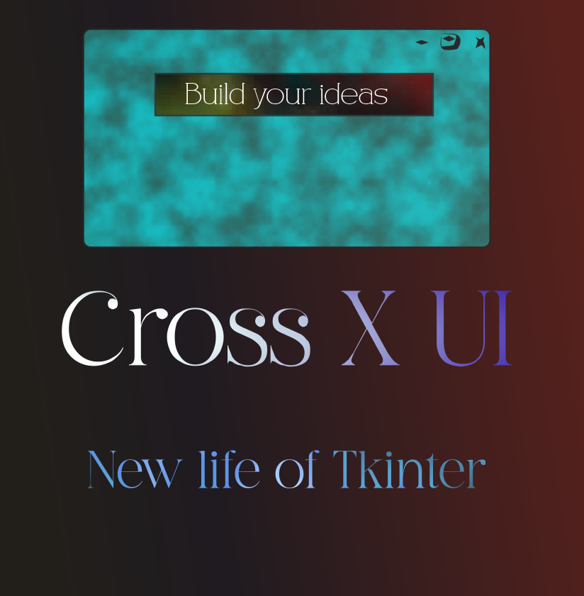

# Cross-UI-ALQ


 This is Tkinter powered modern library for UI/UX desinging module
# Changes of version system
version= core_version.UI_VERSION.UX_version.widget_version

# version 0.0.0.5

* 1. Added Events System
* 2. Added Some of Inputs
# FOURTH COMMIT CHANGES version 0.0.0.4:
* 1. Added Button Functionality
* 2. Added Label


# Documentation:

# 1. Widgets:
## ```Widgets.Window.Window()```  added in version 0.0.1 
#### Represents a window in the application.
#### * window (tk.Tk): The main Tkinter window.
#### * name (str): The name of the window.
#### * background (Color/LinearGradient/RadialGradient): The background of the window.
#### * projectTree (dict): A dictionary representing the project tree structure.
#### * backdrop (tk.Canvas): The canvas for the window background.
#### * last_ev_width (int): Last recorded width of the window.
#### * last_ev_height (int): Last recorded height of the window.
### Functions
```def __init__(self, name="MainWindow", background=Color(size_of_area=(800, 600), color=(255, 255, 255, 255))):```
#### Initialize the Window object with a name and background.

### Args:
#### name (str): The name of the window. Default is "MainWindow".
#### background (Color/LinearGradient/RadialGradient): The background of the window.
``` def __add_child__(self, child):```
#### Add a child to the project tree.
### Args:
#### child: The child object to add to the project tree.
```def __on__RESIZE(self, event):```
#### Handle window resize event.

### Args:
#### event: The resize event object.

